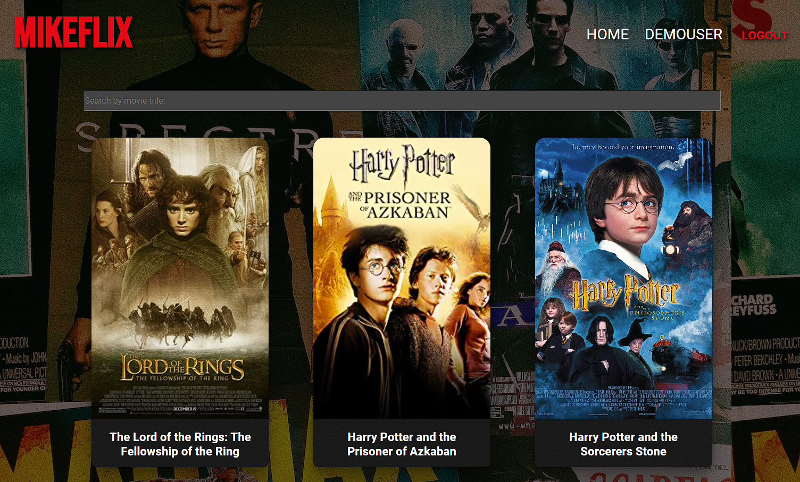

# MikeFlix

##### Movie App Client side using React

## Description

Project that display movies.

Check it out live at [MikeFlix](https://mikeflix.netlify.app/)

## Get Started

- Clone the project
- run npm install to install all dependancies

### Application Use

The website displays movies stored in a database.
You can click on each movie to see additional details and find movies with the same director or genre.
You can also select favorite movies that will be displayed in your user page.

### Dependencies

- axios: ^1.1.3
- parcel: ^2.0.7
- prop-types: ^15.8.1
- react: ^18.2.0
- react-dom: ^18.2.0
- react-redux: ^8.0.5
- react-router-dom: ^6.4.3
- redux: ^4.2.0
- redux-devtools-extension: ^2.13.9

### Tech

- React
- React Bootstrap
- MongoDB
- Express

## Authors

Miguel Semedo
